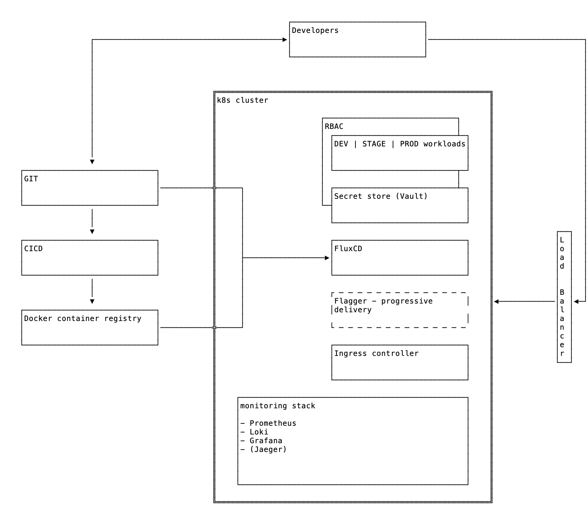

# README #

## Notes ##

### Kubernetes workload challenge ###

- Point 5: "Confirm the functionality of the ReadinessProbe"
  - The backend app wouldn't start without a working probe therefore a running pod automatically confirms the probe's functionality.
- Point 6: "Confirm the functionality of the newly created NetworkPolicy"
  - To confirm it, the cluster has to have a network policy engine running, like Calico, Amazon VPC CNI with network policies enabled, etc.
  - Exec into the backed pod and run the following commands:
    - `wget -T5 -O- http://db1.project-plato.svc.cluster.local:6379` -> should answer
    - `wget -T5 -O- http://db2.project-plato.svc.cluster.local:5432` -> should answer
    - `wget -T5 -O- http://httpforever.com/` -> should give a timeout
- Point 7: "Confirm the availability of the Secret contents in the Deployment"
  - Exec into the db2 pod and run the following command: `env | grep ADMIN`
- Bonus: Postgres
  - The manifest assumes FluxCD running on the cluster and picking up the changes from the Git repository and reconciling them.
  - The `HelmRelease` manifest runs with the default values, it only enables the Prometheus exporter as an extra.
- Bonus: kube-prometheus-stack
  - The manifest assumes FluxCD running on the cluster and picking up the changes from the Git repository and reconciling them.
  - The `HelmRelease` manifest runs with the default values, it only adds a scrape config for Postgres.

### Infrastructure ###

- Assumptions
  - The complete infrastructure is deployed in the cloud (i.e. AWS), no on-prem parts are involved
  - Trunk based development in Git
  - 3 development environment: dev, stage and production
  - For the sake of simplicity everything runs on a single cluster
  - Databases (if any) are managed outside of the cluster
    - I personally like this approach better as running them on the cluster can make life much more harder compared to a managed solution
  - DNS entries are managed in the cluster (i.e. external-dns) - not shown on the diagram
  
- Building blocks
  - Git server (Gitlab)
  - CICD (Gitlab-CI)
  - Docker container registry (Gitlab)
  - Kubernetes cluster (AWS EKS)
  - Load balancer (AWS NLB or ALB) - TLS certificates are automatically managed with AWS cert manager
  - Ingress controller (NGINX)
  - FLuxCD (GitOps CD tool)
  - Flagger (progressive delivery)
  - Monitoring stack
    - Prometheus
    - Loki
    - Grafana
    - Jaeger - in-app tracing
  - Vault as secret store for the applications (Hashicorp Vault)
  - dev, stage and production workloads

- Deployment
  - Cluster: either with Terraform or `eksctl`
  - FluxCD - manually
  - Rest: via Flux

- Workflow
  - Developer merges a PR into the `main` branch -> dev build with CICD -> dev deployment with Flux (pulls the new image from the container registry)
  - Developer tag a commit with a "stage" tag (i.e `v1.0-rc.1`) -> stage build with CICD -> stage deployment with Flux
  - Developer tag a commit with a "prod" tag (i.e `v1.0`) -> prod build with CICD -> production deployment with Flux
  - The workflow can have approval points or it can even be set as a real continous delivery

- Access
  - Accessing the applications on the cluster is via its load balancer (and the ingress controller), both for the developers and the general public
  - Kubernetes RBAC sets who can access and what on the cluster, so that developers can check and manage the workloads in their jurisdiction

- Security considerations
  - The Kubernets nodes are deployed in private subnets so direct access to the nodes from the outside word is not possible
  - The Kubernetes API can be set to private and its access can be restricted to certain IP ranges and/or to a VPN
  - RBAC is applied to the cluster for the fine-grained access control
  - A network policy engine is running on the cluster, so Kubernetes network policies can regulate the access among the workloads
  - If needed, the in-cluster application traffic can also be encrypted, using a service mesh (i.e. Istio)

- Monitoring stack
  - Prometheus for collecting metrics
  - Loki for collecting logs (with an optional long term storage on S3)
  - Grafana for visualizing both metric and log dashboards
  - Optionally Jaeger, for providing in-app telemetry among the microservices

- Other
  - Developer tools to manage the workloads: `kubectl`, `k9s`
  - Backup and DR
    - Thanks to the GitOps based approach the workloads can easily be restored/transfered if needed
    - Even a full cluster rebuild could be done in a relatively short time
    - Persistent volumes however need a backup solution
      - Velero backup is a good candidate
      - Or home brewed backup scripts that run as Kubernetes jobs and save the data to an external location (i.e. S3)
